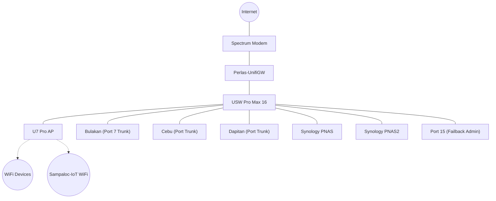

# 🛡️ UniFi Router & Network Setup

> **Device:** UniFi Cloud Gateway Max (UCG Max)
> **Hostname:** `Perlas-UnifiGW`
> **Gateway IP:** `192.168.1.1` (Default) / `192.168.10.1` (VLAN 10 MGMT)
> **Last Documented:** 2026-07-30

---

## System Information

| Property | Value |
|----------|-------|
| **Model** | UniFi Cloud Gateway Max (UCG Max) |
| **UniFi OS** | UniFi OS 5.x |
| **Network Application** | Network 10.x |

---

## Internet (WAN)

| Property | Value |
|----------|-------|
| **ISP Interface** | Primary (WAN1) |
| **Connection Type** | DHCP (IPv4) |
| **WAN IP Allocation** | Dynamic ISP / DHCP |
| **Routing Mode** | Gateway / NAT Routing |

---

## Network Segmentation (VLANs)

The network is segmented into standardized Class C (`192.168.x.x /24`) Virtual LANs aligned with their corresponding VLAN IDs:

| Name | VLAN ID | Subnet | Gateway | DHCP Range | Purpose |
|:-----|:--------|:-------|:--------|:-----------|:--------|
| **Default** | 1 | `192.168.1.0/24` | `192.168.1.1` | `192.168.1.100 - 249` | Legacy Management & Native Workloads |
| **MGMT** | 10 | `192.168.10.0/24` | `192.168.10.1` | `192.168.10.200 - 249` | Hypervisor Hosts, Switches, Storage Web GUIs |
| **TRUSTED** | 20 | `192.168.20.0/24` | `192.168.20.1` | `192.168.20.100 - 249` | Admin Workstations & Daily Use Devices |
| **IOT** | 30 | `192.168.30.0/24` | `192.168.30.1` | `192.168.30.100 - 249` | Home Assistant, Smart TVs, Wireless Sensors |
| **SERVICES** | 110 | `192.168.110.0/24` | `192.168.110.1` | `192.168.110.100 - 249` | Internal Services (Plex, Arr Stack, Immich) |
| **DMZ** | 120 | `192.168.120.0/24` | `192.168.120.1` | `192.168.120.100 - 249` | Ingress Proxies & Tunnels (Cloudflared, NPM) |

---

## WiFi Networks

| SSID | Network / VLAN | Bands | Devices / Scope |
|:-----|:---------------|:------|:----------------|
| **Sampaloc** | Native Network (VLAN 1) | 2.4 GHz, 5 GHz, 6 GHz | All APs (including U7 Pro) - Trusted Clients |
| **Sampaloc-IoT** | IOT (VLAN 30) | 2.4 GHz Only | Smart Home & IoT Devices (Isolated) |
| **Bataan** | Native Network (VLAN 1) | 2.4 GHz Only | Legacy 2.4 GHz Infrastructure |

---

## Infrastructure Topology

### Device Inventory
| Device | Model | IP Address | Role | MAC Address |
|:-------|:------|:-----------|:-----|:------------|
| **Gateway** | UCG Max | `192.168.1.1` / `192.168.10.1` | Core Router | `00:11:22:33:44:55` |
| **Switch** | USW Pro Max 16 | `192.168.1.141` / `192.168.10.141` | Core Switch | `00:11:22:33:44:55` |
| **Access Point** | U7 Pro | `192.168.1.124` / `192.168.10.124` | WiFi 7 AP | `00:11:22:33:44:55` |

---

## Physical Port Mapping (USW Pro Max 16)

| Port | Device / Destination | Native VLAN | Tagged VLANs | Notes |
|:-----|:---------------------|:------------|:-------------|:------|
| 1 | Perlas-UnifiGW | Default (1) | Allow All | Main Uplink |
| 4 | Infrastructure | Default (1) | None | Infrastructure |
| 6 | Infrastructure | Default (1) | None | Infrastructure |
| 7 | Proxmox Bulakan | Default (1) | Allow All (10, 20, 30, 110, 120) | Hypervisor Trunk Port |
| 8 | PNAS | Default (1) | None | Synology NAS Storage |
| 9 | Infrastructure | Default (1) | None | Infrastructure |
| 10 | Admin PC | Default (1) | None | Management PC |
| 11 | Proxmox Cebu | Default (1) | Allow All (10, 20, 30, 110, 120) | Hypervisor Trunk Port |
| 12 | Proxmox Dapitan | Default (1) | Allow All (10, 20, 30, 110, 120) | Hypervisor Trunk Port |
| 13 | PNAS2 | Default (1) | None | Secondary NAS Storage |
| 15 | FAILBACK-ADMIN-PORT | Default (1) | Block All Tagged | Out-of-band Break-Glass Port |
| 16 | U7 Pro AP | Default (1) | Allow All | WiFi 7 Access Point Trunk |

---

## Services & Security

### DNS Configuration
The network uses local Pi-Hole instances for ad-blocking and DNS resolution:
| Resolver | IP Address | Subnet / Location | Notes |
|:---------|:-----------|:------------------|:------|
| **Primary DNS** | `192.168.1.5` / `192.168.110.5` | Bulakan (CT 301) | Primary DNS Sinkhole |
| **Secondary DNS** | `192.168.1.43` / `192.168.110.6` | Cebu (CT 401) | Secondary DNS Sinkhole |

### VPN
- **WireGuard:** Enabled (One-Click VPN). Active for remote management.

### Port Forwarding
| Name | Port | Target IP | Notes |
|:-----|:-----|:----------|:------|
| **Bulakan-Plex** | 32400 | `192.168.1.x` | External Plex Access |
| **Luzon-Plex** | 32400 | `192.168.1.x` | Secondary Plex Access |
| **unRAID-Jellyfin** | 8096 | `192.168.1.126` | Legacy Jellyfin access |

---

## Management & Navigation Paths

### Where to Manage Network & Firewall Settings

1. **Subnet & Virtual Network Setup:**
   - **Path:** `Settings` → `Networks` → `New Network`

2. **Switch Port Trunking Configuration:**
   - **Path:** `Devices` → `USW Pro Max 16` → `Port Manager` → Select Port → Set `Native Network` & `Traffic Restriction` (`Allow All`).

3. **Firewall IP & Port Groups:**
   - **Path:** `Settings` → `Security` → `Firewall Rules` → `IP/Port Groups`

4. **Wireless Networks (SSIDs):**
   - **Path:** `Settings` → `WiFi` → `Create New Network`

---

## Related Documentation
- [UniFi Preemptive Foundation Setup Guide](file:////opt/homelab-infrastructure/04-Network/UniFi-Preemptive-Foundation-Setup.md)
- [Class C Subnet & IP Allocation Schema Recommendation](file:////opt/homelab-infrastructure/04-Network/Class-C-Subnet-Schema-Recommendation.md)
- [Network Overview](file:////opt/homelab-infrastructure/04-Network/Network%20Overview.md)
- [Services Master Index](file:////opt/homelab-infrastructure/05-Services/Services%20Index.md)

