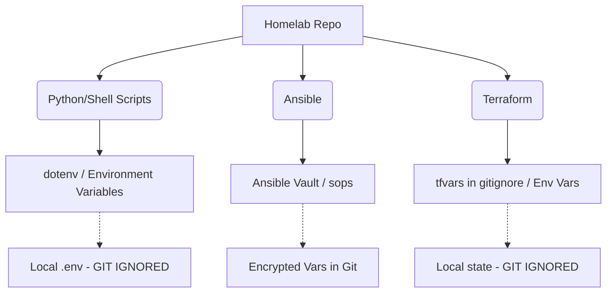

# Homelab Secrets Management Best Practices

* **Date**: May 16, 2026
* **Objective**: Secure the homelab configuration repository for safe GitHub backups by identifying existing plaintext credentials, establishing a robust secrets management architecture, and implementing secure coding standards.

---

## 🚨 CRITICAL AUDIT ALERT: Plaintext Credentials Found!

During a proactive security audit, several Python scripts inside the `scripts/` directory were identified as containing plaintext credentials for the root account on Proxmox nodes (`192.168.1.25` and `192.168.1.26`):

*   [[proxmox-ssh-fix.py]] in `scripts/proxmox-ssh-fix.py`
*   [[proxmox-fix-final.py]] in `scripts/proxmox-fix-final.py`
*   [[proxmox-fix-all.py]] in `scripts/proxmox-fix-all.py`
*   [[proxmox-final-fixes.py]] in `scripts/proxmox-final-fixes.py`
*   [[proxmox-check-storage.py]] in `scripts/proxmox-check-storage.py`

Specifically, the following hardcoded line was discovered:
```python
PASSWORD = "Jiggu1ot!@#"
```

> [!WARNING]
> If this repository is backed up or synchronized to GitHub (public or private), **your Proxmox root passwords will be exposed to the public internet or GitHub's storage**. Because git preserves all commit history, simply deleting the line and committing will **not** remove it from your commit history.

---

## 🛠️ Immediate Remediation Steps

### 1. Rotate the Password
Since the password `"Jiggu1ot!@#"` has been written to disk in plain text within a git workspace, assume it has been or could be compromised. 
1. Log into your Proxmox hosts (`Bulakan` and `Cebu`).
2. Run `passwd` to change the root password to a new, strong, random password.

### 2. Purge Secrets from Git History
To completely erase the exposed password from the repository's git history before pushing it, use **`git-filter-repo`** (the official, modern replacement for `git filter-branch`).

1. Install `git-filter-repo`:
   ```powershell
   pip install git-filter-repo
   ```
2. Create a file named `secrets.txt` outside of your repository containing the exact password string you want to remove:
   ```text
   Jiggu1ot!@#
   ```
3. Run the following command at the root of your `homelab` repository:
   ```bash
   git filter-repo --replace-text /path/to/secrets.txt
   ```
   This will scan the entire history and replace all occurrences of `Jiggu1ot!@#` with `***REMOVED***`.
4. Delete the temporary `/path/to/secrets.txt` file immediately.

---

## 🔒 Homelab Secrets Management Architecture

To safely back up your code to GitHub, adopt a **multi-layered secrets management strategy** appropriate for homelab and Infrastructure as Code (IaC) files:



### 1. Scripts: Environment Variables (`.env`) & `.gitignore`

#### The Rule:
*   **Never** assign credentials to a hardcoded string variable.
*   **Always** read credentials from the system environment or a `.env` file that is listed in `.gitignore`.
*   Provide a `.env.example` file containing placeholder configurations as a template for other developers or your future self.

#### Secure Refactoring Example:
Here is how [proxmox-ssh-fix.py](file:////opt/homelab-infrastructure/scripts/proxmox-ssh-fix.py) should be structured:

```python
import os
import sys
import subprocess

# 1. Look in the environment variables first
PASSWORD = os.getenv("PROXMOX_PASS")

# 2. Optional: Load from a local .env file if it exists (using python-dotenv)
if not PASSWORD:
    try:
        from dotenv import load_dotenv
        load_dotenv()
        PASSWORD = os.getenv("PROXMOX_PASS")
    except ImportError:
        pass

# 3. Fail gracefully if the secret is missing
if not PASSWORD:
    print("[ERROR] PROXMOX_PASS environment variable is not set!", file=sys.stderr)
    print("Please set it in your environment or add it to a local .env file.", file=sys.stderr)
    sys.exit(1)
```

---

### 2. Infrastructure as Code (Terraform)

#### Secrets in Variables (`.tfvars`):
Never hardcode credentials in your `.tf` configuration files. Instead:
1. Define the secret as a variable:
   ```hcl
   variable "proxmox_api_password" {
     type      = string
     sensitive = true
   }
   ```
2. Store the actual values in a local `secret.tfvars` file:
   ```hcl
   proxmox_api_password = "MySuperSecretPassword"
   ```
3. Exclude it from git. Your `terraform/.gitignore` contains `*.tfvars`, which is correct! However, you must ensure that your **root repository `.gitignore`** also covers these files if you commit from the repository root.

#### The State File Danger (`.tfstate`):
> [!IMPORTANT]
> **Terraform state files (`.tfstate` and `.tfstate.backup`) contain PLAINTEXT versions of ALL secrets used in your configuration!**
> You must **NEVER** commit `.tfstate` files to GitHub. 
> *   Keep them locally ignored via `.gitignore` (which is already configured in your [terraform/.gitignore](file:////opt/homelab-infrastructure/terraform/.gitignore)), OR
> *   Use a secure remote backend (e.g., PostgreSQL backend on Cebu, Consul, or AWS S3 with KMS encryption) to store your state off-site.

---

### 3. Configuration Management (Ansible Vault)

If you use Ansible to configure your systems, encrypt sensitive parameters (e.g., API keys, root passwords) using **Ansible Vault**.

#### Encrypting a Single Variable:
Create an encrypted string directly:
```bash
ansible-vault encrypt_string 'MySuperSecretPassword' --name 'proxmox_password'
```
You can safely paste the resulting output block directly into your YAML configuration files:
```yaml
proxmox_password: !vault |
          $ANSIBLE_VAULT;1.1;AES256
          36373133373238623762613134373466336335343461623136616666326162633036663737633234
          63333333333333333333333333333333333333333333333333333333333333333333333333333333
```

#### Encrypting a Whole Variable File:
1. Put secrets in `ansible/vars/secrets.yml`:
   ```yaml
   proxmox_root_password: "MySuperSecretPassword"
   cloudflare_api_token: "AnotherSecret"
   ```
2. Encrypt the file:
   ```bash
   ansible-vault encrypt ansible/vars/secrets.yml
   ```
3. When running playbook, supply `--ask-vault-pass` or configure a `.ansible_vault_pass` file (which is git-ignored!).

---

### 4. Advanced: SOPS (Secrets Operations)

For enterprise-grade homelab repository setups, **Mozilla SOPS** is highly recommended. It allows you to encrypt files (YAML, JSON, ENV) with keys (such as PGP or `age`), and commit the encrypted file directly to Git.

*   You can edit the file seamlessly: `sops vars/secrets.enc.yml` automatically decrypts the file in your editor and re-encrypts it on save.
*   It supports Git diffs out of the box, meaning you can see exactly which secret was changed/added without exposing the values themselves.

---

## 📝 Hardening Your Repository .gitignore

To ensure no environment variables, temporary test scripts, or local state files accidentally leak into GitHub, update the **root repository `.gitignore`** with comprehensive rules.

Here is the recommended configuration for [homelab/.gitignore](file:////opt/homelab-infrastructure/.gitignore):

```text
# CISSP Resources
/CISSP/books/

# Environment Files
.env
.env.local
.env.*.local
*.env

# Python Virtual Environments & Packages
.venv/
venv/
ENV/
__pycache__/
*.pyc

# Terraform
.terraform/
.terraform.lock.hcl
*.tfstate
*.tfstate.backup
*.tfvars
*.tfvars.json
*.tfplan

# Ansible Vault password files
.ansible_vault_pass
vault-password.txt

# Sensitive temporary scratch files
scratch/secrets/
scratch/*.tmp
scripts/*.tmp
```

---

## 🔗 References and Resources

1.  **Git Filter-Repo**: [github.com/newren/git-filter-repo](https://github.com/newren/git-filter-repo) (Removes secrets from Git history)
2.  **Ansible Vault Guide**: [docs.ansible.com/ansible/latest/vault.html](https://docs.ansible.com/ansible/latest/vault.html)
3.  **Mozilla SOPS**: [github.com/getsops/sops](https://github.com/getsops/sops) (Best-in-class file-level Git encryption)
4.  **1Password CLI**: [developer.1password.com/docs/cli](https://developer.1password.com/docs/cli) (Dynamic injection of passwords directly from vault at runtime)
