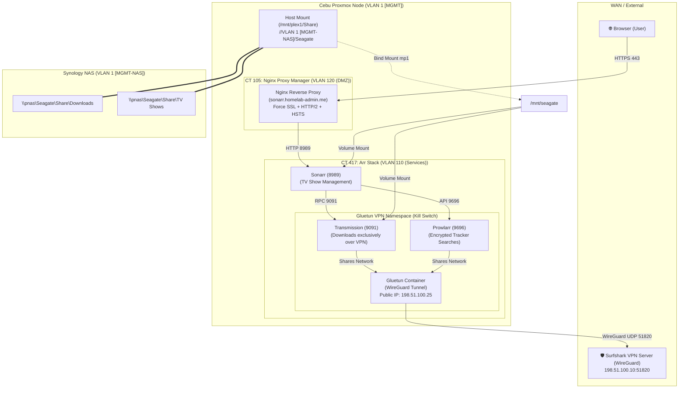

# 📚 Master Guide: Complete Sonarr, NPM Reverse Proxy, NAS Storage & Surfshark WireGuard Setup

- **Date:** August 22, 2026
- **Objective:** Comprehensive step-by-step documentation detailing the diagnosis, configuration, and verification of the Arr stack (Sonarr, Prowlarr, Transmission, Gluetun), Nginx Proxy Manager wildcard SSL routing, Synology NAS storage integration, and Surfshark WireGuard fail-closed killswitch protection.
- **Maintainer:** Perlas

---

## 🗺️ Architectural Overview



---

## 📑 Table of Contents
1. [Phase 1: Fixing Nginx Proxy Manager (Default Landing Page $\rightarrow$ Secure Reverse Proxy)](#phase-1-fixing-nginx-proxy-manager)
2. [Phase 2: Resolving Sonarr Health Errors & Prowlarr VLAN 110 Sync](#phase-2-resolving-sonarr-health-errors)
3. [Phase 3: Connecting Synology NAS Storage (Downloads & TV Shows)](#phase-3-connecting-synology-nas-storage)
4. [Phase 4: Surfshark WireGuard Migration & Guaranteed Killswitch](#phase-4-surfshark-wireguard-migration)
5. [Phase 5: Verification & Testing Playbook](#phase-5-verification--testing-playbook)

---

## 🛠️ Phase 1: Fixing Nginx Proxy Manager

### Problem Diagnosed
Accessing `sonarr.homelab-admin.me` loaded the default Nginx Proxy Manager splash screen (*"Congratulations! You've successfully started Nginx Proxy Manager... host isn't set up yet"*).

### Root Cause
DNS was successfully pointing `sonarr.homelab-admin.me` to NPM on Cebu CT 105 (`VLAN 120 (DMZ)`), but NPM did not have a **Proxy Host** entry or server configuration file for that domain.

### Step-by-Step Resolution

1. **Deploy Nginx Configuration File (`/data/nginx/proxy_host/15.conf`):**
   ```nginx
   map $scheme $hsts_header {
       https   "max-age=63072000; preload";
   }

   server {
     set $forward_scheme http;
     set $server         "VLAN 110 (Services)";
     set $port           8989;

     listen 80;
     listen [::]:80;
     listen 443 ssl;
     listen [::]:443 ssl;

     server_name sonarr.homelab-admin.me;
     http2 on;

     # Wildcard Let's Encrypt Certificate
     ssl_certificate /etc/letsencrypt/live/npm-3/fullchain.pem;
     ssl_certificate_key /etc/letsencrypt/live/npm-3/privkey.pem;

     # Security Headers & SSL Enforcement
     add_header Strict-Transport-Security $hsts_header always;
     set $trust_forwarded_proto "F";
     include /etc/nginx/conf.d/include/force-ssl.conf;
     include /etc/nginx/conf.d/include/block-exploits.conf;

     # Websockets
     proxy_set_header Upgrade $http_upgrade;
     proxy_set_header Connection $http_connection;
     proxy_http_version 1.1;

     location / {
       include /etc/nginx/conf.d/include/proxy.conf;
     }
   }
   ```

2. **Synchronize NPM SQLite Database (`/data/database.sqlite`):**
   Inserted row `id=15` into the `proxy_host` table so the new proxy host is recognized and editable in the NPM Web UI.

3. **Validate Syntax & Reload Gracefully:**
   ```bash
   nginx -t
   nginx -s reload
   ```
   *Rationale: `nginx -t` ensures zero syntax errors before reloading. `nginx -s reload` performs an atomic daemon reload without dropping live connections.*

---

## 🛠️ Phase 2: Resolving Sonarr Health Errors

### Problems Diagnosed
Sonarr displayed 4 critical health check errors:
1. `No download client is available`
2. `All rss-capable indexers are temporarily unavailable due to recent indexer errors`
3. `All indexers are unavailable due to failures`
4. `All search-capable indexers are temporarily unavailable due to recent indexer errors`

### Root Cause
- When the Arr stack container was migrated to **SERVICES VLAN 110** (`VLAN 110 (Services)`), Prowlarr application sync and Sonarr's indexer database entries were still hardcoded to the old IP (`VLAN 1 (Mgmt):9696`).
- Sonarr could not reach Prowlarr to query indexers, disabling all indexers.
- No download client was registered in Sonarr.

### Step-by-Step Resolution

1. **Update Prowlarr Application Mappings:**
   Updated Prowlarr's database (`prowlarr.db`) to point Sonarr and Radarr to `VLAN 110 (Services)`.
2. **Update Sonarr Indexers Base URL:**
   Updated Sonarr's database (`sonarr.db`) `Indexers` table to `http://VLAN 110 (Services):9696/1/`.
3. **Register Transmission Download Client:**
   Added Transmission via Sonarr's REST API (`POST /api/v3/downloadclient`):
   - **Host:** `VLAN 110 (Services)`
   - **Port:** `9091`
   - **URL Base:** `/transmission/`
   - **Category:** `tv-sonarr`
4. **Trigger Sync & Verification:**
   Tested indexers (**LimeTorrents** and **The Pirate Bay**) via `/api/v3/indexer/test`. Both tests succeeded.

---

## 🛠️ Phase 3: Connecting Synology NAS Storage

### Goal
- Map **Downloads** to `\\pnas\Seagate\Share\Downloads`
- Map **TV Shows** to `\\pnas\Seagate\Share\TV Shows`

### Step-by-Step Resolution

1. **Attach CIFS Share to Proxmox LXC Container:**
   The Synology share was already mounted on the Proxmox host at `/mnt/plex1/Share`. We hotplugged a bind-mount to CT 417:
   ```bash
   pct set 417 -mp1 /mnt/plex1/Share,mp=/mnt/seagate
   ```
   *Result inside CT 417: `/mnt/seagate/Downloads` and `/mnt/seagate/TV Shows` became immediately accessible.*

2. **Update Docker Compose Volume Bindings (`/root/arr-stack/docker-compose.yml`):**
   ```yaml
   transmission:
     volumes:
       - ./config/transmission:/config
       - /mnt/seagate/Downloads:/downloads
       - ./data/watch:/watch

   sonarr:
     volumes:
       - ./config/sonarr:/config
       - /mnt/seagate/TV Shows:/tv
       - /mnt/seagate/Downloads:/downloads

   radarr:
     volumes:
       - ./config/radarr:/config
       - /mnt/seagate/Movies:/movies
       - /mnt/seagate/Downloads:/downloads
   ```

3. **Register Sonarr Root Folder:**
   Executed API call `POST /api/v3/rootfolder` with `{"path": "/tv"}`. Sonarr instantly scanned and indexed all 110+ existing TV series on the NAS.

---

## 🛠️ Phase 4: Surfshark WireGuard Migration & Killswitch

### Goal
Switch Gluetun from OpenVPN to **WireGuard** and guarantee that Transmission can never download without the VPN.

### Step-by-Step Resolution

1. **Retrieve WireGuard Credentials:**
   Extracted WireGuard client keys and endpoint configuration from Surfshark:
   - **Private Key:** `YDkMDr5SgS9cp5rTZPvyJHMalNyxODxhNapee4bknFg=`
   - **Address:** `10.14.0.2/16`
   - **Endpoint:** `198.51.100.10:51820` (San Francisco)
   - **Server Public Key:** `7SpGSSI78hf8jy689ec5Ql0/Gsq0LLHDmjEFsGUWl1k=`

2. **Configure Gluetun in `docker-compose.yml`:**
   ```yaml
   gluetun:
     image: qmcgaw/gluetun
     container_name: gluetun
     cap_add:
       - NET_ADMIN
     devices:
       - /dev/net/tun:/dev/net/tun
     ports:
       - "9117:9117" # Jackett
       - "9696:9696" # Prowlarr
       - "9091:9091" # Transmission Web UI
       - "51413:51413"
       - "51413:51413/udp"
     environment:
       - VPN_SERVICE_PROVIDER=custom
       - VPN_TYPE=wireguard
       - WIREGUARD_PRIVATE_KEY=<YOUR_WIREGUARD_PRIVATE_KEY>
       - WIREGUARD_ADDRESSES=10.14.0.2/16
       - WIREGUARD_PUBLIC_KEY=<SURFSHARK_SERVER_PUBLIC_KEY>
       - WIREGUARD_ENDPOINT_IP=198.51.100.10
       - WIREGUARD_ENDPOINT_PORT=51820
       - DOT=off
       - DNS_PLAINTEXT_ADDRESS=1.1.1.1
       - FIREWALL_OUTBOUND_SUBNETS=192.168.1.0/24,VLAN 110 (Services)/24,VLAN 120 (DMZ)/24
       - TZ=America/Los_Angeles
     restart: always
   ```

3. **How the Fail-Closed Killswitch Works:**
   - **Shared Network Namespace:** Transmission is configured with `network_mode: "service:gluetun"`. It has no physical or virtual network interface of its own; it sends all traffic directly through Gluetun's stack.
   - **Kernel-Level Firewall:** Gluetun configures Linux `iptables` drop rules by default. Traffic is only allowed to flow through `tun0`/`wg0` or to local LAN subnets defined in `FIREWALL_OUTBOUND_SUBNETS`.
   - **Killswitch Guarantee:** If WireGuard drops, the `wg0` interface goes down, and all non-VPN outgoing traffic is silently and completely dropped. No data can leak through your ISP WAN.

---

## 🧪 Phase 5: Verification & Testing Playbook

Run these commands inside Cebu CT 417 to verify the entire system at any time:

### 1. Check WireGuard Public IP & VPN Provider
```bash
docker exec transmission wget -qO- https://ipinfo.io/json
```
**Expected Output:**
```json
{
  "ip": "198.51.100.25",
  "org": "AS60068 Datacamp Limited"
}
```
*(Confirms traffic is exiting through Surfshark's encrypted WireGuard tunnel)*

### 2. Verify Sonarr Health via API
```bash
curl -s -H "X-Api-Key: <YOUR_SONARR_API_KEY>" http://127.0.0.1:8989/api/v3/health
```
**Expected Output:**
```json
[]
```
*(Empty array confirms 0 warnings and 0 errors)*

### 3. Verify Nginx Proxy Manager HTTPS Endpoint
```bash
curl -I -k https://sonarr.homelab-admin.me/
```
**Expected Output:** `HTTP/2 401` or `HTTP/2 200` with valid TLS certificate.

---

## 📚 References
- [Gluetun Wiki](https://github.com/qdm12/gluetun-wiki)
- [Nginx Proxy Manager Documentation](https://nginxproxymanager.com/)
- [Sonarr Documentation](https://wiki.servarr.com/sonarr)
- [Trash Guides - Arr Stack Configuration](https://trash-guides.info/)
