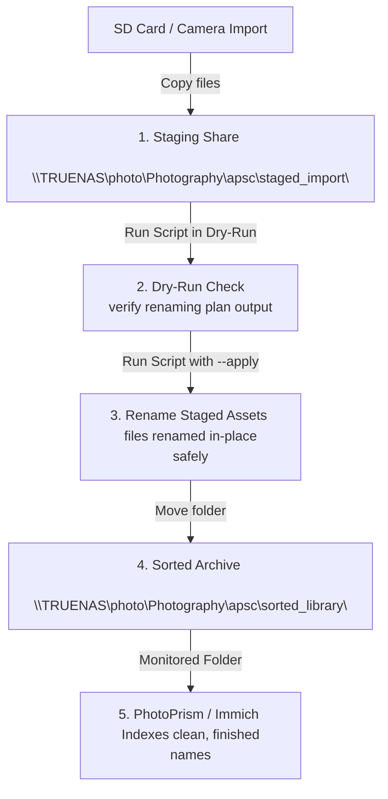

# 📸 TrueNAS Photo Renaming Automation Guide

* **Date**: May 16, 2026
* **Objective**: Standardize, parse, and automate chronological and location-aware renaming of mirrorless/APS-C camera photos on your TrueNAS SMB share (`\\TRUENAS\photo\Photography\apsc`).
* **Design Pattern**: Chronological sorting + location extraction (`timestamp-city/country`) with RAW+JPEG synchronicity, automated geocoding, collision safeguarding, and dry-run assurance.

---

## 1. System Context & Workflow

Your homelab contains a dual-node Proxmox VE cluster (`Bulakan` & `Cebu`) running major photo cataloging applications:
1. **PhotoPrism** (Bulakan LXC 111) — AI-driven photo indexing.
2. **Immich** (Bulakan VM 204) — Modern self-hosted photo backup and management.

These applications index assets stored on your TrueNAS share. Direct, in-place renaming of files in a monitored catalog folder can lead to duplicate database indexing, metadata fragmentation, or infinite re-scan loops.

### The Staging Workflow (Best Practice)
To keep your databases clean, follow this operational workflow:


---

## 2. Technical Prerequisites

The script runs locally on your Windows client (or can be containerized/run on a Proxmox VM accessing the SMB share).

1. **Python 3.10+** (already configured in your environment).
2. **ExifTool (Recommended)**: 
   * The script uses ExifTool to read RAW camera files (like Fujifilm `.RAF`, Sony `.ARW`, Canon `.CR3`) and JPEGs.
   * If ExifTool is missing, the script gracefully falls back to Pillow (PIL) for JPEG files, but will skip raw files.
   * *To install on Windows*: Download ExifTool from [exiftool.org](https://exiftool.org/), rename `exiftool(-k).exe` to `exiftool.exe`, and add it to your Windows System environment variable `PATH`.
3. **Geopy (For Automatic Geocoding)**:
   * Enables coordinate lookups via OpenStreetMap's Nominatim API.
   * Install via pip:
     ```cmd
     pip install geopy
     ```

---

## 3. Script Features & Architecture

The script (`scripts/photo-renamer.py`) has been built with safe, premium defaults:

* **Dry-Run Safety**: The script will **never** modify any files unless explicitly executed with the `--apply` flag.
* **Zero Timeline Drift / Timestamp Preservation**: Captures the exact original modification (`st_mtime`) and access (`st_atime`) timestamps down to the microsecond *before* renaming, and explicitly restores them using `os.utime` *after* renaming. This guarantees that your file timeline in PhotoPrism, Immich, Windows, or Synology Photos remains 100% authentic and completely unchanged.
* **RAW + JPEG Cohesion**: Grouping logic pairs identical stems (e.g., `DSCF1002.RAF` and `DSCF1002.JPG`) before processing, ensuring both raw and JPEG files get matching names and counters.
* **Burst Collision Avoidance**: High-speed burst captures taking place in the exact same second are automatically appended with unique sequence counters (e.g., `-1`, `-2`).
* **Caching & Rate-Limiting**: Strictly respects Nominatim reverse-geocoding API usage terms by enforcing a 1.0-second delay between coordinates and caching redundant locations locally.

---

## 4. Renaming Schemas

You can execute the renamer using three separate, built-in syntaxes using the `--schema` (or `-s`) parameter:

| Schema Code | Option Style | Syntax | Example |
| :--- | :--- | :--- | :--- |
| `compact` *(Default)* | Option A | `YYYYMMDD-HHMMSS-City-Country.ext` | `20241024-143022-Tokyo-Japan.jpg` |
| `readable` | Option B | `YYYY-MM-DD_HH-MM-SS_City_Country.ext` | `2024-10-24_14-05-30_Tokyo_Japan.jpg` |
| `sequence` | Option C | `YYYYMMDD-HHMMSS_City-Country_DSCXXXX.ext` | `20241024-143022_Tokyo-Japan_DSC8241.jpg` |

---

## 5. Operational Commands & Guides

Open terminal or PowerShell in your homelab workspace (`/opt/homelab-infrastructure`):

### 1. Perform a Safe Dry-Run (Preview only)
Analyze your imported folder and preview exactly what the new filenames will look like:
```cmd
python scripts/photo-renamer.py "\\TRUENAS\photo\Photography\apsc\staged_import"
```

### 2. Rename Using GPS Coordinates (Active)
Apply the names using the default compact schema:
```cmd
python scripts/photo-renamer.py "\\TRUENAS\photo\Photography\apsc\staged_import" --apply
```

### 3. Specify Location Manually (No GPS fallback)
If your camera does not embed GPS, manually specify the location for the entire folder batch:
```cmd
python scripts/photo-renamer.py "\\TRUENAS\photo\Photography\apsc\staged_import" --location "Munich-Germany" --apply
```

### 4. Recursive Subfolder Renaming with Readable Schema
Scan subfolders recursively, process raw files, and write them in Option B (highly readable) format:
```cmd
python scripts/photo-renamer.py "\\TRUENAS\photo\Photography\apsc\staged_import" --recursive --schema readable --apply
```

---

## 6. Verification and Troubleshooting

* **Missing EXIF Dates**: If a photo does not contain creation metadata (e.g. online downloads or raw exports that stripped metadata), the script falls back safely to the filesystem's `modified date (mtime)`.
* **Rate Limits**: If geocoding queries fail, check your internet connectivity. The Nominatim API restricts high frequency lookups, which is why a `1.0-second delay` and internal geocoding caching are baked into `photo-renamer.py`.
* **Offline Fallback**: In the absence of GPS coordinates or geopy library, the script automatically inherits the location from the folder structure (e.g. if the folder name is `Tokyo_Trip`, it extracts `Tokyo_Trip` as the location).

---

## References
* [ExifTool Application Reference](https://exiftool.org)
* [PhotoPrism Metadata Matching Docs](https://docs.photoprism.app)
* [Immich Storage Templates Guide](https://immich.app/docs/features/custom-folder-structure)
