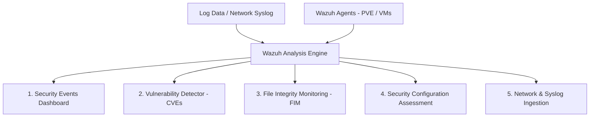

# 🚀 Wazuh SIEM & XDR: Beginner's Starter Guide

> **Date:** 2026-08-14  
> **Objective:** Comprehensive beginner guide for navigating, understanding, and managing Wazuh SIEM & XDR in the `Homelab-Net` homelab.  
> **Dashboard URL:** `https://192.168.10.250` (**VLAN 10 MGMT**)  
> **Admin Username:** `admin`  
> **Admin Password:** `WazuhAdmin2026-`  
> **Target Audience:** Homelab Administrator / Beginners  

---

## 1. What is Wazuh? (Core Concepts)

Wazuh is an open-source **Security Information and Event Management (SIEM)** and **Extended Detection and Response (XDR)** platform. In your homelab, it acts as a central security command post that collects, analyzes, and correlates security logs from your hypervisors, virtual machines, containers, and UniFi network devices.

### Core Modules Explained



1. **Security Events (SIEM)**: Real-time analysis of system events, authentication failures, SSH brute-force attempts, and network firewall drops.
2. **Vulnerability Detector**: Scans registered operating systems and software against official CVE (Common Vulnerabilities and Exposures) databases to highlight unpatched security flaws.
3. **File Integrity Monitoring (FIM / `syscheck`)**: Detects when critical system files (like `/etc/passwd`, `/etc/shadow`, or binary executables) are created, modified, or deleted.
4. **Security Configuration Assessment (SCA)**: Scans hosts against CIS (Center for Internet Security) benchmarks to verify system hardening best practices.
5. **Active Response**: Automated defensive actions (such as blocking an attacking IP address on a workstation) when specific threat thresholds are triggered.

---

## 2. First-Time Dashboard Login & Navigation

1. Open your browser and navigate to **`https://192.168.10.250`** *(Accept the self-signed TLS certificate warning)*.
2. Log in with your admin credentials:
   - **Username**: `admin`
   - **Password**: `WazuhAdmin2026-`

### Understanding Alert Severity Levels

Wazuh classifies all security events on a scale from **Level 0 to Level 15**:

| Level | Severity | Description & Example | Action Required |
| :---: | :---: | :--- | :--- |
| **0 – 3** | **Informational** | Normal system operation, routine log entry, user login | None |
| **4 – 6** | **Low** | Minor configuration changes, sudo command executions | Monitor |
| **7 – 9** | **Medium** | Repeated failed login attempts, unknown connection | Inspect log source |
| **10 – 12** | **High** | Multiple failed SSH logins (Brute Force), file modification in `/etc` | Active Investigation |
| **13 – 15** | **Critical** | Rootkit detection, automated threat match, unauthorized privilege escalation | Immediate Remediation |

---

## 3. How to Use Key Wazuh Modules

### A. Checking Agent Status
- Navigate to **Wazuh Menu (Top-Left ☰)** → **Agents**.
- You will see a list of registered hosts (e.g., `000: wazuh-siem`, `001: cebu`).
- **Active (Green)**: Host is actively transmitting logs and heartbeats.
- **Disconnected (Red)**: Host has stopped communicating for >30 minutes (check agent service or firewall).

---

### B. Investigating Security Events
- Navigate to **Wazuh Menu** → **Security Events**.
- Use the search bar at the top to filter events:
  - Filter by Agent: `agent.name: "cebu"`
  - Filter by Severity: `rule.level >= 7`
  - Filter by Failed SSH Logins: `rule.id: 5716`
- Click on any event row to expand full JSON details showing source IP, user, command executed, and exact rule trigger.

---

### C. Viewing Software Vulnerabilities (CVE Scans)
- Navigate to **Wazuh Menu** → **Vulnerability Detector**.
- Review the **Vulnerability Summary** pie charts showing *Critical*, *High*, and *Medium* severity software bugs.
- Select an agent (e.g., `cebu` or `Perlas-W10`) to view exact unpatched package names and installed versions.

---

### D. File Integrity Monitoring (FIM / `syscheck`)
- Navigate to **Wazuh Menu** → **Integrity Monitoring**.
- This module alerts you whenever files inside monitored folders (such as `/etc`, `/usr/bin`, `/sbin`) change.
- Click **Events** to view exact file diffs, who modified the file, and timestamps.

---

## 4. How to Add a New Agent (Step-by-Step)

To monitor another machine (e.g., node `Bulakan`, `Dapitan`, or a Linux VM):

### Option A: Via Wazuh Web Dashboard (Easiest)
1. In the Wazuh Dashboard, click **Agents** → **Deploy New Agent**.
2. Select your OS: **Debian / Ubuntu / Windows / macOS**.
3. Enter the Manager IP: **`192.168.10.250`**.
4. Assign an Agent Name (e.g., `bulakan` or `dapitan`).
5. Copy the generated one-line command and run it in the target machine's terminal.

### Option B: Linux Terminal Command (Debian/Ubuntu)
Run the following commands on the target node:
```bash
# 1. Add Wazuh Repository
curl -s https://packages.wazuh.com/key/GPG-KEY-WAZUH | gpg --no-default-keyring --keyring gnupg-ring:/usr/share/keyrings/wazuh.gpg --import && chmod 644 /usr/share/keyrings/wazuh.gpg
echo "deb [signed-by=/usr/share/keyrings/wazuh.gpg] https://packages.wazuh.com/4.x/apt/ stable main" | tee /etc/apt/sources.list.d/wazuh.list
apt-get update

# 2. Install Wazuh Agent (Version 4.11.2)
WAZUH_MANAGER="192.168.10.250" apt-get install -y wazuh-agent=4.11.2-1

# 3. Register Agent with Manager
/var/ossec/bin/agent-auth -m 192.168.10.250

# 4. Start & Enable Agent Service
systemctl enable --now wazuh-agent
```

---

## 5. Essential Management & Troubleshooting CLI Commands

All commands below are executed via SSH on the **Wazuh Server VM (`192.168.10.250`)** or target agent node:

### On Wazuh Server (`192.168.10.250`):

```bash
# List all registered agents and their current connection state
/var/ossec/bin/agent_control -l

# Check detailed status of a specific agent (e.g., Agent ID 001)
/var/ossec/bin/agent_control -i 001

# Test custom syslog rules or test log parsing before adding to rulesets
/var/ossec/bin/wazuh-logtest

# Restart Wazuh Manager Stack
systemctl restart wazuh-manager
systemctl restart wazuh-indexer
systemctl restart wazuh-dashboard
```

### On Agent Nodes (e.g., `Cebu` `192.168.1.26`):

```bash
# Check agent service status
systemctl status wazuh-agent

# Read real-time agent log output
tail -f /var/ossec/logs/ossec.log

# Force immediate agent reconnection to manager
systemctl restart wazuh-agent
```

---

## 6. Homelab Best Practices for Beginners

1. **Active Response Caution**: Keep Active Response **disabled on hypervisor hosts** (`Bulakan`, `Cebu`, `Dapitan`). You do not want automated firewall block scripts disconnecting Proxmox cluster nodes during routine administrative tasks.
2. **Log Retention Management**: To keep the `cebu-zfs` storage pool healthy, Wazuh is configured to retain indices for **14 days**. Do not disable automated index deletion policies without checking available disk space.
3. **UniFi Gateway Integration**: Forward UniFi UCG Max logs by going to UniFi OS → **Settings → System → Advanced → Syslog** → Remote Server IP: **`192.168.10.250:514`** (UDP).

---

## 7. Related Homelab Documentation

- [Wazuh SIEM Deployment Guide (2026-08-14)](file:////opt/homelab-infrastructure/06-Guides/Wazuh-SIEM-Deployment-Guide-2026-08-14.md)
- [Proxmox Overview](file:////opt/homelab-infrastructure/02-Proxmox/Proxmox%20Overview.md)
- [Network Overview](file:////opt/homelab-infrastructure/04-Network/Network%20Overview.md)
- [Class C Subnet & IP Allocation Schema Recommendation](file:////opt/homelab-infrastructure/04-Network/Class-C-Subnet-Schema-Recommendation.md)
- [Services Master Index](file:////opt/homelab-infrastructure/05-Services/Services%20Index.md)
