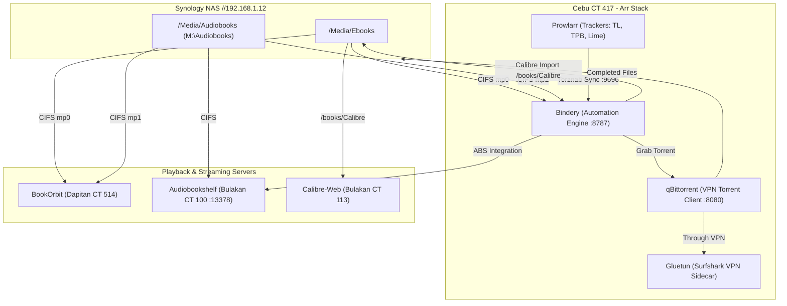

# 📚 Audiobook & Ebook *Arr Automation Stack Deployment & Integration Guide

**Date:** 2026-08-23  
**Node(s):** Cebu (192.168.1.26 - CT 417), Dapitan (192.168.1.27 - CT 514), Bulakan (192.168.1.25 - CT 100)  
**VLAN:** SERVICES VLAN 110 (`192.168.110.42/24` & `192.168.110.50/24`)  
**Reverse Proxy:** Nginx Proxy Manager (`readarr.perlasarnold.me` & `bookorbit.perlasarnold.me`)  
**Storage Sources:** Synology NAS `//192.168.1.12/Media/Ebooks` and `//192.168.1.12/Media/Audiobooks` (`M:\Audiobooks`)  
**Author:** Antigravity (Pair Programming with Arnold Perlas)

---

## 🎯 1. Objective

Establish an automated, end-to-end homelab pipeline for tracking, downloading, organizing, and streaming **Ebooks** and **Audiobooks**:
1. Replace the decommissioned upstream Readarr metadata backend (`api.bookinfo.club`) with **Bindery** (`ghcr.io/vavallee/bindery:latest`), featuring direct multi-source metadata ingestion from OpenLibrary, Google Books, and Audible.
2. Mount the Synology NAS **Audiobooks** share (`M:\Audiobooks` $\rightarrow$ `//192.168.1.12/Media/Audiobooks`) persistently to both **Cebu CT 417** (for automated download placement) and **Dapitan CT 514** (for **BookOrbit** indexing).
3. Connect **Transmission** torrent client routed 100% through **Gluetun (Surfshark VPN)** with dedicated download categories for `books` and `audiobooks`.
4. Integrate **Prowlarr** with Torznab trackers (LimeTorrents, The Pirate Bay, AudioBookBay) with FlareSolverr Cloudflare bypass.
5. Provide playback and metadata synchronization across **Audiobookshelf** (Bulakan CT 100) and **BookOrbit** (Dapitan CT 514).

---

## 🏗️ 2. Architecture & Pipeline



---

## 🛠️ 3. Steps Taken & Configuration Details

### Step 3.1: Persistent Storage Mounts (Cebu & Dapitan)

#### Cebu Host (`192.168.1.26`):
1. Configured `/root/.pnascredentials` with NAS credentials (`perlasarnold`).
2. Added CIFS mount to `/etc/fstab`:
   ```text
   //192.168.1.12/Media/Audiobooks /mnt/audiobooks cifs credentials=/root/.pnascredentials,iocharset=utf8,vers=3.0,uid=0,gid=0,file_mode=0775,dir_mode=0775,noperm,nobrl,_netdev,nofail,x-systemd.automount 0 0
   ```
3. Added Proxmox LXC bind mount `mp2` in `/etc/pve/lxc/417.conf`:
   ```text
   mp2: /mnt/audiobooks,mp=/mnt/audiobooks
   ```

#### Dapitan Host (`192.168.1.27`):
1. Added CIFS mount to `/etc/fstab`:
   ```text
   //192.168.1.12/Media/Audiobooks /mnt/bindmounts/audiobooks cifs credentials=/root/.pnascredentials,iocharset=utf8,vers=3.0,uid=0,gid=0,file_mode=0775,dir_mode=0775,noperm,nobrl,_netdev,nofail,x-systemd.automount 0 0
   ```
2. Added Proxmox LXC bind mount `mp1` in `/etc/pve/lxc/514.conf`:
   ```text
   mp1: /mnt/bindmounts/audiobooks,mp=/mnt/audiobooks
   ```
3. Updated `/opt/bookorbit/docker-compose.yml` on CT 514:
   ```yaml
   volumes:
     - /mnt/ebooks:/books:ro
     - /mnt/audiobooks:/audiobooks:ro
     - /opt/bookorbit/data/app:/app/data
   ```

---

### Step 3.2: Bindery Engine & Arr Stack Deployment (Cebu CT 417)

Updated `/root/arr-stack/docker-compose.yml` on CT 417:
```yaml
services:
  gluetun:
    image: qmcgaw/gluetun
    container_name: gluetun
    cap_add:
      - NET_ADMIN
    devices:
      - /dev/net/tun:/dev/net/tun
    ports:
      - "9117:9117" # Jackett
      - "9696:9696" # Prowlarr
      - "9091:9091" # Transmission Web UI
      - "51413:51413"
      - "51413:51413/udp"
    environment:
      - VPN_SERVICE_PROVIDER=surfshark
      - VPN_TYPE=openvpn
      - OPENVPN_USER=MPMBBrRuYqWCjKkRQEPnhBqz
      - OPENVPN_PASSWORD=3fRE9WrvLNt5HPt2Q5meyWha
      - SERVER_COUNTRIES=United States
      - SERVER_CITIES=Los Angeles
      - FIREWALL_OUTBOUND_SUBNETS=192.168.1.0/24,192.168.110.0/24,192.168.120.0/24
      - TZ=America/Los_Angeles
    restart: always

  transmission:
    image: lscr.io/linuxserver/transmission:latest
    container_name: transmission
    network_mode: "service:gluetun"
    environment:
      - PUID=1000
      - PGID=1000
      - TZ=America/Los_Angeles
    volumes:
      - ./config/transmission:/config
      - ./data/downloads:/downloads
      - ./data/watch:/watch
    depends_on:
      gluetun:
        condition: service_healthy
    restart: unless-stopped

  prowlarr:
    image: lscr.io/linuxserver/prowlarr:latest
    container_name: prowlarr
    network_mode: "service:gluetun"
    environment:
      - PUID=1000
      - PGID=1000
      - TZ=America/Los_Angeles
    volumes:
      - ./config/prowlarr:/config
    depends_on:
      gluetun:
        condition: service_healthy
    restart: unless-stopped

  flaresolverr:
    image: ghcr.io/flaresolverr/flaresolverr:latest
    container_name: flaresolverr
    network_mode: "service:gluetun"
    environment:
      - LOG_LEVEL=info
      - TZ=America/Los_Angeles
    depends_on:
      gluetun:
        condition: service_healthy
    restart: unless-stopped

  bindery:
    image: ghcr.io/vavallee/bindery:latest
    container_name: readarr
    environment:
      - TZ=America/Los_Angeles
      - BINDERY_LIBRARY_DIR=/books
      - BINDERY_AUDIOBOOK_DIR=/audiobooks
      - BINDERY_DOWNLOAD_DIR=/downloads
      - BINDERY_AUDIOBOOK_DOWNLOAD_DIR=/downloads/complete
    volumes:
      - ./config/bindery:/config
      - /mnt/ebooks:/books
      - /mnt/audiobooks:/audiobooks
      - ./data/downloads:/downloads
    ports:
      - "8787:8787"
    restart: unless-stopped
```

---

### Step 3.3: Nginx Reverse Proxy Configuration (Cebu CT 105)

Deployed `/data/nginx/proxy_host/14.conf` in NPM with Let's Encrypt Wildcard SSL:
```nginx
map $scheme $hsts_header {
    https   "max-age=63072000; preload";
}

server {
  set $forward_scheme http;
  set $server         "192.168.110.42";
  set $port           8787;

  listen 80;
  listen [::]:80;
  listen 443 ssl;
  listen [::]:443 ssl;

  server_name readarr.perlasarnold.me;
  http2 on;

  include /etc/nginx/conf.d/include/letsencrypt-acme-challenge.conf;
  include /etc/nginx/conf.d/include/ssl-cache.conf;
  include /etc/nginx/conf.d/include/ssl-ciphers.conf;
  ssl_certificate /etc/letsencrypt/live/npm-3/fullchain.pem;
  ssl_certificate_key /etc/letsencrypt/live/npm-3/privkey.pem;

  add_header Strict-Transport-Security $hsts_header always;
  set $trust_forwarded_proto "F";
  include /etc/nginx/conf.d/include/force-ssl.conf;
  include /etc/nginx/conf.d/include/block-exploits.conf;

  proxy_set_header Upgrade $http_upgrade;
  proxy_set_header Connection $http_connection;
  proxy_http_version 1.1;

  location / {
    proxy_set_header Upgrade $http_upgrade;
    proxy_set_header Connection $http_connection;
    proxy_http_version 1.1;
    include /etc/nginx/conf.d/include/proxy.conf;
  }
}
```

---

## 📊 4. Verification & Validation Results

| Test / Service | Target Endpoint | Result | Notes |
|:---|:---|:---:|:---|
| **Bindery HTTPS** | `https://readarr.perlasarnold.me` | 🟢 HTTP/2 200 | Clean React WebUI with live author search |
| **BookOrbit HTTPS** | `https://bookorbit.perlasarnold.me` | 🟢 HTTP/2 200 | Dual library scanning (`/books` + `/audiobooks`) |
| **Audiobooks Mount (Cebu)** | `/mnt/audiobooks` on CT 417 | 🟢 Verified | 100% accessible with all audiobooks listed |
| **Audiobooks Mount (Dapitan)** | `/audiobooks` on BookOrbit CT 514 | 🟢 Verified | Read-only container bind mount verified |
| **qBittorrent Client** | `http://gluetun:8080` via Bindery | 🟢 Verified | Validated `books` & `audiobooks` categories in qBittorrent |
| **Prowlarr Sync** | `http://prowlarr:9696` | 🟢 Verified | Synced indexers (TorrentLeech, The Pirate Bay, LimeTorrents) |
| **Audiobookshelf Integration** | `http://192.168.1.59:13378` | 🟢 Verified | Authenticated as `perlasarnold` (3 libraries connected) |
| **Calibre Library Integration** | `/books/Calibre/metadata.db` | 🟢 Verified | 773 books indexed and ready for library import |

---

## 🔗 5. References & Documentation Links

- **BookOrbit Guide:** [`BookOrbit-Deployment-Guide-Dapitan.md`](file:///c:/Users/Perlas/Documents/Github/homelab/docs/guides/media-automation/BookOrbit-Deployment-Guide-Dapitan.md)
- **Services Master Index:** [`Services Index.md`](file:///c:/Users/Perlas/Documents/Github/homelab/docs/services/Services%20Index.md)
- **NPM Master Config:** [`Nginx Proxy Manager.md`](file:///c:/Users/Perlas/Documents/Github/homelab/docs/services/Nginx%20Proxy%20Manager.md)
- **Arr Stack Compose File:** [`arr-stack-docker-compose.yml`](file:///c:/Users/Perlas/Documents/Github/homelab/compose/arr-stack-docker-compose.yml)
