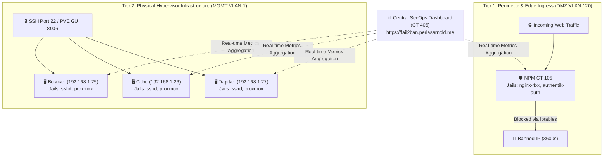

# 🛡️ Fail2Ban & Security Dashboard

* **Category:** Security & Intrusion Prevention
* **Node:** Cebu (`192.168.1.26`)
* **LXC ID:** CT 406
* **VLAN Segment:** VLAN 10 (SecOps / MGMT)
* **IP Address:** `192.168.10.50`
* **Web UI / DNS:** `https://fail2ban.perlasarnold.me` (Port 8705)
* **Managed By:** Ansible (`roles/fail2ban`) & Terraform (`cebu.tf`)

---

## 🎯 Architecture Overview

Fail2Ban operates as a comprehensive **two-tier multi-point intrusion prevention system**:



### 1. Tier 1: Ingress Edge & Reverse Proxy (CT 105)
* **`nginx-4xx` Jail:** Monitors `/data/logs/default-host_error.log` for malicious URL scanners, vulnerability probes, and non-existent subpaths.
* **`authentik-auth` Jail:** Monitors `/data/logs/proxy-host-*.log` for credential stuffing and brute-force attacks against Authentik SSO.

### 2. Tier 2: Physical Proxmox Hypervisors (Bulakan, Cebu, Dapitan)
* **`sshd` Jail:** Actively monitors systemd SSH journal to block automated brute-force attacks on Port 22.
* **`proxmox` Jail:** Monitors `/var/log/daemon.log` to detect and drop failed authentication attempts against the Proxmox Web GUI (`https://<node-ip>:8006`).

### 3. Lockout Protection (`ignoreip`)
All nodes and containers enforce strict allowlists to prevent locking out administrator sessions:
* `127.0.0.1/8` (Localhost)
* `192.168.1.0/24` (Management VLAN 1)
* `192.168.20.0/24` (Trusted VLAN 20)
* `192.168.110.0/24` (Services VLAN 110)
* `100.64.0.0/10` (Tailscale CGNAT Subnet)

---

## ⚙️ Configuration Files

* **Jail Configuration (CT 105 & CT 406):** `/etc/fail2ban/jail.local`
* **4xx Filter Definition:** `/etc/fail2ban/filter.d/nginx-4xx.conf`
* **Authentik Auth Filter Definition:** `/etc/fail2ban/filter.d/authentik-auth.conf`
* **Dashboard Service:** `/etc/systemd/system/fail2ban-dashboard.service`

---

## 🛠️ Verification & Useful Commands

```bash
# Check active jails on perimeter proxy (CT 105)
pct exec 105 -- fail2ban-client status

# Check specific jail metrics and banned IP list
pct exec 105 -- fail2ban-client status nginx-4xx
pct exec 105 -- fail2ban-client status authentik-auth

# Live tail of security events
pct exec 105 -- tail -f /var/log/fail2ban.log
```
