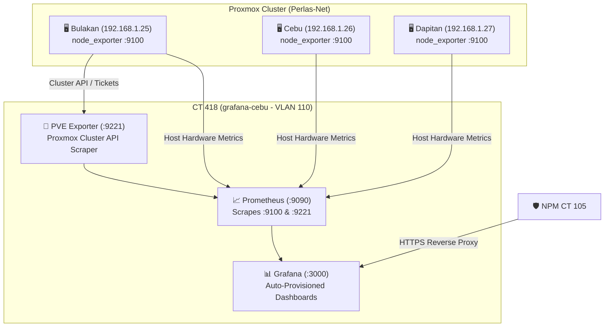

# 📊 Grafana Observability & Metrics

* **Category:** Monitoring & Telemetry
* **Node:** Cebu (`192.168.1.26`)
* **LXC ID:** CT 418
* **VLAN Segment:** VLAN 110 (Services)
* **IP Address:** `192.168.110.60`
* **Web UI / DNS:** `https://grafana.perlasarnold.me` (Port 3000)
* **Telemetry Engines:** Prometheus (`localhost:9090`), `node_exporter` (`:9100`), `proxmox-pve-exporter` (`:9221`)
* **Managed By:** Ansible (`roles/grafana`) & Terraform (`cebu.tf`)

---

## 🎯 Architecture Overview

Grafana serves as the centralized visualization and metrics dashboard for the entire 3-node Proxmox cluster (Bulakan, Cebu, Dapitan), its physical hardware, and all active LXC containers/VMs.



---

## 📋 Auto-Provisioned Dashboards

1. **[Perlas-Net Homelab Infrastructure Overview](https://grafana.perlasarnold.me/d/homelab-overview/perlas-net-homelab-infrastructure-overview):**
   * **Cluster Gauges:** Real-time physical host Gauges (CPU % / RAM % / Host Uptime).
   * **System Load:** 1-minute and 5-minute CPU Load Average timeline graphs across Bulakan, Cebu, and Dapitan.
   * **Memory Allocation:** Total physical RAM vs. Active used RAM.
   * **Network Throughput:** Live RX / TX network bandwidth across physical network bridges (`vmbr0`, `vmbr1`).

2. **[Proxmox Containers & VMs Drilldown](https://grafana.perlasarnold.me/d/proxmox-guests-drilldown/proxmox-containers-and-vms-drilldown):**
   * **Cluster Guest Status:** Bar gauges indicating online/running status for every LXC container and VM across all 3 nodes.
   * **Dynamic Dropdown Selector:** Filter and inspect any container or VM (`lxc/103 Authentik`, `lxc/110 Jellyfin`, `lxc/504 Immich`, `qemu/250 Wazuh`, etc.).
   * **Resource Drilldown:** Real-time allocated CPU %, RAM %, and Guest Uptime history for the selected guest.

---

## 🛠️ Step-by-Step Configuration Runbook

### Step 1: Proxmox Cluster API Token Setup
Run on the primary Proxmox node (`192.168.1.25`):
```bash
pveum role add PVEAuditor -privs 'VM.Audit Sys.Audit Sys.Modify Datastore.Audit'
pveum user add prometheus@pve -comment 'Prometheus PVE Exporter'
pveum acl modify / -user prometheus@pve -role PVEAuditor
pveum user token add prometheus@pve prom-token -privsep 0
```

### Step 2: Deploy `prometheus-pve-exporter` on CT 418
```bash
apt install -y python3-pip python3-full
pip3 install --break-system-packages prometheus-pve-exporter

cat << 'EOF' > /etc/pve-exporter/pve.yml
default:
  user: prometheus@pve
  token_name: prom-token
  token_value: bb37602b-9556-4b81-9c81-f5b8b2821896
  verify_ssl: false
EOF

cat << 'EOF' > /etc/systemd/system/pve-exporter.service
[Unit]
Description=Prometheus Proxmox VE Exporter
After=network.target

[Service]
Type=simple
User=root
ExecStart=/usr/local/bin/pve_exporter --config.file /etc/pve-exporter/pve.yml --web.listen-address 0.0.0.0:9221
Restart=always

[Install]
WantedBy=multi-user.target
EOF

systemctl daemon-reload
systemctl enable --now pve-exporter
```

### Step 3: Install `prometheus-node-exporter` on All Hypervisors
Run on Bulakan (`192.168.1.25`), Cebu (`192.168.1.26`), and Dapitan (`192.168.1.27`):
```bash
apt update && apt install -y prometheus-node-exporter
systemctl enable --now prometheus-node-exporter
```

### Step 4: Configure Prometheus Ingestion (`/etc/prometheus/prometheus.yml`)
```yaml
global:
  scrape_interval: 15s
  evaluation_interval: 15s

scrape_configs:
  - job_name: 'proxmox_nodes'
    static_configs:
      - targets: ['192.168.1.25:9100']
        labels:
          node: 'Bulakan (Host 1)'
      - targets: ['192.168.1.26:9100']
        labels:
          node: 'Cebu (Host 2)'
      - targets: ['192.168.1.27:9100']
        labels:
          node: 'Dapitan (Host 3)'

  - job_name: 'proxmox_pve'
    metrics_path: /pve
    params:
      module: ['default']
    static_configs:
      - targets: ['192.168.1.25']
        labels:
          cluster: 'Perlas-Net'
    relabel_configs:
      - source_labels: [__address__]
        target_label: __param_target
      - source_labels: [__param_target]
        target_label: instance
      - target_label: __address__
        replacement: 127.0.0.1:9221
```

### Step 5: Auto-Provision Grafana Datasources & Dashboards
* **Datasource Config:** `/etc/grafana/provisioning/datasources/prometheus.yaml`
* **Dashboard Provider Config:** `/etc/grafana/provisioning/dashboards/default.yaml`
* **Dashboard Storage Directory:** `/var/lib/grafana/dashboards/*.json`

